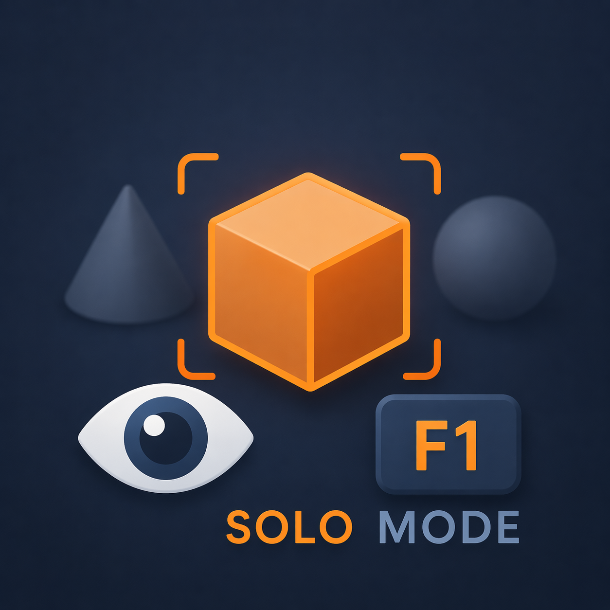

# Solo Mode — Blender Add-on

Isolate selected objects in the 3D Viewport instantly. Think of it like a **mute / solo button** for your scene — hide everything except what you're working on, then bring it all back with one click or one keypress.

---

## Features

- **Solo toggle** — select object(s), press **Enter Solo**. Press again to restore the full scene.
- **Multi-object solo** — select multiple objects, solo them all at once.
- **F1 shortcut** — fastest way to toggle. Auto-skips binding if F1 is already in use.
- **Collection** — optionally include all objects that share a collection with selected objects.
- **📦 Collection Instance Members** — keeps the full grouped / instance family of the selected object visible.
- **Header button** — eye icon button lives in the 3D Viewport header for quick access.
- **Non-destructive** — only hides objects that were already visible. Your manually hidden objects stay hidden.

---

## Installation

1. Download `solo_mode.zip`
2. Open Blender → **Edit → Preferences → Add-ons → Install**
3. Select `solo_mode.zip` — do **not** unzip it
4. Enable **Solo Mode** from the add-ons list
5. Open the **N-Panel** (press `N` in the 3D Viewport) → go to the **Solo** tab

---

## How to Use

### Basic Solo
1. Select the object(s) you want to isolate
2. Click **Enter Solo** in the N-Panel or press **F1**
3. Only selected objects remain visible
4. Press **F1** again (or click **Exit Solo**) to restore everything

### Switch to a Different Set
1. While in Solo Mode, exit first (`F1`)
2. Select new objects
3. Press `F1` again to solo the new selection

### Multi-object Solo
Select multiple objects with `Shift + Click` before pressing `F1` — all selected objects will be isolated together.

---

## Options

| Option | Description |
|---|---|
| **Collection** | Includes all other objects that share a collection with the selected objects |
| **Collection Instance Members** | Keeps the full grouped / instanced family of the selected object visible |

These checkboxes are in the N-Panel under **Include with Solo**. Set them before pressing **Enter Solo**.

---

## 📦 Collection Instance Members

This option is designed for working with grouped assets and instance-style objects as if they were a single object.

When enabled, Solo Mode keeps the selected object's **root family** visible.

That means:

- if you select one part of a car, the whole car stays visible
- if the selected object belongs to a grouped hierarchy, the rest of that grouped hierarchy stays visible
- other unrelated grouped objects stay hidden
- this does **not** behave like the normal **Collection** option

### Intended behavior

| Scenario | Result |
|---|---|
| Select one part of **Car 1** and enable **Collection Instance Members** | The whole **Car 1** stays visible |
| **Car 2** is another grouped object in the scene | **Car 2** stays hidden |
| Use normal **Collection** instead | Other objects in the same Blender collection may also be included |

### Why this option exists

In real workflow, artists often think of the **group root** or the **instance empty** as the actual object body.

For example:
- a car with many parts
- a character with many pieces
- a heavy grouped asset

You usually want to work on only **one full object**, not every other object that happens to live inside the same source collection.

That is why **Collection Instance Members** is treated as an **instance-aware / hierarchy-aware solo helper**, not as a normal collection-wide reveal.

---

## Terminology Cheat Sheet

| Term | Meaning | Blender / Outliner Hint |
|---|---|---|
| **Collection** | Folder or grouped set of objects | Folder-style grouping |
| **Collection Instance** | Empty object that represents a whole collection | Instance / Empty object |
| **Root Family** | Top parent plus all child objects under it | Full grouped object |

---

## Behavior

By default, soloing an object shows exactly what you selected.

- Enable **Collection** to include objects that share the same Blender collection.
- Enable **Collection Instance Members** to keep the full grouped / root family of the selected object visible.

---

## Keyboard Shortcut

| Key | Action |
|---|---|
| `F1` | Toggle Solo Mode on / off |

> The add-on checks for conflicts before binding `F1`. If `F1` is already used in your Blender keymap, the shortcut is skipped automatically and a message is printed to the console. You can manually assign a different key via **Edit → Preferences → Keymap**.

---

## Compatibility

| | |
|---|---|
| Blender Version | 4.2 and above |
| Render Engine | Any (works in Object Mode, viewport only) |
| OS | Windows, macOS, Linux |

---

## Changelog

### v1.0.8
- Removed **All Parents Connected**
- Simplified the workflow to focus on **Collection** and **Collection Instance Members**
- Collection Instance Members now acts as the main smart grouped-object mode
- Better for cars, characters, and complex grouped assets
- Blender 4.2+ compatible

### v1.0.7
- Fixed **Collection Instance Members** behavior
- Keeps the selected object's full root family visible
- Better support for grouped assets such as cars, characters, and assemblies
- Prevents unrelated grouped objects from remaining visible

### v1.0.6
- Improved Collection Instance Members behavior
- Better support for collection-instance workflows

### v1.0.5
- Added **Collection Instance Members** option
- Added support for instance-aware solo workflows

### v1.0.3
- Added eye icon to N-Panel header
- F1 shortcut with automatic conflict detection
- Packaged as proper `__init__.py` add-on

### v1.0.2
- F1 keybinding added
- Author credit added to panel

### v1.0.1
- Fixed blank N-Panel caused by `IDPropertyGroup` dict incompatibility
- Switched to primitive scene props for state storage

### v1.0.0
- Initial release
- Solo toggle
- Multi-object support
- Parent chain support
- Collection support

---

## License

GPL-3.0-or-later

This add-on is distributed under the GNU General Public License v3.0 or later.

---

by Vincent Ilagan